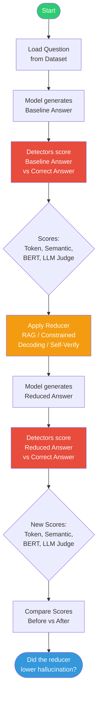

# 🔬 LLM Hallucination Detection & Reduction Benchmark — Ollama Edition

Test **any LLM** for hallucination using 4 detection methods, then measure how
**reduction methods** (RAG, Constrained Decoding, Self-Verification) lower
hallucination scores.

Based on detection techniques from the
[AWS ML blog: "Detect hallucinations for RAG-based systems" (2025)](https://aws.amazon.com/blogs/machine-learning/detect-hallucinations-for-rag-based-systems/).

**100% local. No API keys. No GPU setup. Just Ollama.**

---

## 🧪 Experiment Workflow

```
For each question in the dataset:

  1. Model generates a BASELINE answer (no help)
  2. All 4 detectors score the answer against the correct answer → baseline scores
  3. For each REDUCER (RAG, Constrained Decoding, Self-Verification):
       a. Model generates a new answer using that strategy
       b. All 4 detectors score the new answer → reduced scores
  4. Compare: which reducer lowered hallucination scores the most?
```

---

## 🔄 Experiment Flowchart



## ⚡ Quick Start (3 commands)

```bash
# 1. Install Ollama
curl -fsSL https://ollama.com/install.sh | sh   # Linux/Mac
# Windows: download from https://ollama.com/download

# 2. Pull models you want to test
ollama pull deepseek-r1:7b
ollama pull qwen2.5:7b

# 3. Run the experiment
pip install -r requirements.txt
python main.py
```

---

## 🤖 Supported Models (just add more to config.yaml!)

| Family | Models in config.yaml |
|--------|----------------------|
| **Meta / Llama** | llama3.2:3b, llama3.1:8b, llama3.3:70b |
| **Google / Gemma** | gemma3:1b, gemma3:4b, gemma3:12b |
| **Mistral** | mistral:7b, mistral-nemo:12b, mixtral:8x7b |
| **Microsoft / Phi** | phi4:14b, phi3.5:3.8b |
| **Alibaba / Qwen** | qwen2.5:7b, qwen2.5:14b, qwen2.5:72b |
| **DeepSeek** | deepseek-r1:7b, deepseek-r1:14b |
| **Cohere** | command-r7b:7b, aya-expanse:8b |
| **TII / Falcon** | falcon3:7b |
| **HuggingFace** | smollm2:1.7b |

**Add ANY model** from https://ollama.com/library by editing `config.yaml`:
```yaml
models:
  - name: "my-model"
    model: "ollama-tag:size"   # exact tag from ollama.com/library
    family: "company"
    auto_pull: false
```

---

## 🛠 CLI Commands

```bash
# See what's installed in Ollama
python main.py --list-models

# See all models defined in config.yaml
python main.py --list-available

# Pull models then run benchmark
python main.py --pull deepseek-r1:7b qwen2.5:7b

# Run specific models only
python main.py --models deepseek-r1-7b qwen2.5-7b

# Fast test (20 samples, synthetic only)
python main.py --quick

# Skip slow BERT stochastic detector
python main.py --no-bert

# Use remote Ollama server
python main.py --host http://192.168.1.10:11434

# Check setup without running inference
python main.py --dry-run
```

---

## 📐 Detection Methods

Four methods score each generated answer against the correct answer from the dataset.
All scores range from 0 (factual) to 1 (hallucinated).

| # | Method | How It Works | Cost |
|---|--------|-------------|------|
| 1 | **Token Similarity** | Measures word overlap (BLEU, ROUGE-L, intersection) between generated and correct answer | Free — no LLM calls |
| 2 | **Semantic Similarity** | Computes cosine similarity of sentence embeddings between generated and correct answer | Free — embeddings only |
| 3 | **LLM Judge** | Asks a separate LLM: "Does this answer match the correct answer?" Returns 0-1 score | 1 LLM call per answer |
| 4 | **BERT Stochastic** | Generates multiple answers and checks consistency — inconsistent answers = likely hallucinated | N+1 LLM calls per answer |

---

## 🔧 Reduction Methods

Three methods that modify how the model generates answers to reduce hallucinations.

| Method | Strategy | Trade-off |
|--------|----------|-----------|
| **RAG** | Provides a reference passage alongside the question so the model can ground its answer in facts | Requires a knowledge source (provided by the dataset in our experiment) |
| **Constrained Decoding** | Lowers temperature (0.1), top_k (5), and top_p (0.3) to force the model to pick only high-confidence tokens | May produce overly conservative or repetitive answers |
| **Self-Verification** | Two-pass: generates answer, then asks the model to verify it. If flagged as incorrect, returns the correction | ~2x slower (two generations per question) |

---

## 📁 Project Structure

```
LLM-hallucination-Research/
├── main.py                  # Main entry point — runs the full experiment
├── quick_demo.py            # Smoke-test (no Ollama required)
├── config.yaml              # All settings — models, datasets, detectors, reducers
├── requirements.txt
│
├── models/
│   ├── base_model.py        # Abstract interface
│   ├── ollama_model.py      # Ollama backend (supports top_p, top_k for constrained decoding)
│   └── model_factory.py     # Builds model list, checks what's installed
│
├── data/
│   └── datasets.py          # HaluEval QA loader + synthetic data generator
│
├── detectors/
│   ├── llm_detector.py      # LLM judge — compares generated answer to correct answer
│   ├── semantic_detector.py # Cosine similarity of sentence embeddings
│   ├── bert_detector.py     # BERT stochastic consistency checker
│   ├── token_detector.py    # BLEU + ROUGE-L + token intersection
│   └── ensemble.py          # Weighted combination (optional)
│
├── reducers/                # NEW — hallucination reduction methods
│   ├── base_reducer.py      # Abstract interface for all reducers
│   ├── rag.py               # Retrieval-Augmented Generation
│   ├── constrained_decoding.py  # Tight generation parameters
│   └── self_verification.py # Two-pass: generate then verify
│
└── benchmark/
    ├── runner.py             # Orchestrates: baseline → reducers → detectors → scores
    ├── evaluator.py          # Computes score reductions, win rates, comparisons
    └── reporter.py           # Console tables + charts + HTML report
```

---

## ⚙️ config.yaml Key Settings

```yaml
# Ollama server (change for remote)
ollama:
  host: "http://localhost:11434"

# Datasets — each sample has: question, context, right_answer, hallucinated_answer
datasets:
  - name: "halueval_qa"
    source: "hf"
    hf_path: "pminervini/HaluEval"
    hf_subset: "qa_samples"
    max_samples: 50

# Reduction methods to apply
reducers:
  rag:
    enabled: true
  constrained_decoding:
    enabled: true
    temperature: 0.1
    top_p: 0.3
    top_k: 5
  self_verification:
    enabled: true

# Detection methods to score each answer
detectors:
  token_similarity:
    enabled: true
  semantic_similarity:
    enabled: true
  llm_based:
    enabled: true
  bert_stochastic:
    enabled: true
    n_samples: 3
```

---

## 📊 Output Files

After running, you'll find these in the `results/` folder:

```
results/
├── all_results.csv                # One row per (model × sample × reducer) with all detector scores
├── report.html                    # Self-contained HTML report with charts and tables
├── summary.json                   # Per-(model × reducer) averaged metrics
├── before_after_per_reducer.png   # Grouped bar chart: baseline vs each reducer across detectors
├── per_detector_comparison.png    # One subplot per detector showing scores by reducer
├── score_reductions.png           # How much each reducer lowered scores vs baseline
└── benchmark.log                  # Full run log
```

### Sample Output Table

```
┌──────────────────────┬──────────┬──────────┬──────────┬──────────┐
│ Reducer              │ Token    │ Semantic │ LLM      │ BERT     │
├──────────────────────┼──────────┼──────────┼──────────┼──────────┤
│ Baseline (no reducer)│ 0.750    │ 0.800    │ 0.700    │ 0.850    │
│ RAG                  │ 0.150    │ 0.200    │ 0.100    │ 0.300    │
│ Constrained Decoding │ 0.550    │ 0.600    │ 0.500    │ 0.700    │
│ Self-Verification    │ 0.400    │ 0.450    │ 0.350    │ 0.550    │
└──────────────────────┴──────────┴──────────┴──────────┴──────────┘
Lower scores = less hallucination. Compare each reducer to the baseline row.
```

---

## 📚 References

- [AWS ML Blog: Detect hallucinations for RAG-based systems (2025)](https://aws.amazon.com/blogs/machine-learning/detect-hallucinations-for-rag-based-systems/)
- [HaluEval benchmark](https://arxiv.org/abs/2305.11747)
- [BERTScore paper](https://arxiv.org/abs/1904.09675)
- [Ollama model library](https://ollama.com/library)

---

## 👥 Contributors

- Dr. Bharat Rawal — Grambling State University, Department of Computer Science and Digital Technologies
- QASC — Quantum-Enhanced AI and Secure Computing