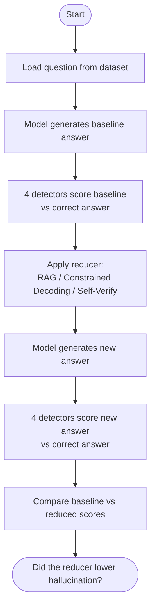

# LLM Hallucination Detection & Reduction Benchmark


A local benchmarking harness that scores LLM hallucinations with four detection
methods, then measures whether three common mitigation strategies — RAG,
constrained decoding, and self-verification — actually reduce them.

Everything runs against a local [Ollama](https://ollama.com) server, so any
installed model can be benchmarked with no API keys and no cloud GPU.

## Research Question

Hallucination detection and hallucination *reduction* are usually discussed
separately: papers benchmark detectors, and blog posts recommend mitigation
techniques, rarely with a shared, reproducible measurement loop connecting
the two. This project builds that loop end-to-end for locally-hosted models:

1. Generate a baseline answer with no mitigation.
2. Score it with four independent hallucination detectors.
3. Regenerate the answer under each reduction strategy (RAG, constrained
   decoding, self-verification).
4. Re-score under the same four detectors.
5. Compare: does the reduction strategy actually lower the hallucination
   score, and at what latency cost?

The detection methods are based on the techniques and precision/recall
trade-offs described in the AWS Machine Learning blog post
["Detect hallucinations for RAG-based systems" (2025)](https://aws.amazon.com/blogs/machine-learning/detect-hallucinations-for-rag-based-systems/).

## Methodology

### Detectors

Each detector scores a generated answer against the dataset's correct answer
on a 0 (factual) → 1 (hallucinated) scale.

| Detector | Signal | Cost |
|---|---|---|
| **Token similarity** (`detectors/token_detector.py`) | BLEU + ROUGE-L + stopword-filtered token intersection between generated and correct answer | No LLM calls |
| **Semantic similarity** (`detectors/semantic_detector.py`) | 1 − cosine similarity between sentence-transformer embeddings (`all-mpnet-base-v2`) of the two answers | Embeddings only |
| **LLM judge** (`detectors/llm_detector.py`) | A few-shot prompted LLM rates 0–1 how well the generated answer matches the correct answer | 1 LLM call per answer |
| **BERT stochastic consistency** (`detectors/bert_detector.py`) | Generates N resampled answers at temperature 1.0 and computes mean BERTScore F1 against the original; low agreement across samples implies hallucination | N+1 LLM calls per answer |

An optional weighted-average ensemble (`detectors/ensemble.py`) combines all
four (default weights: LLM 0.40, BERT 0.35, semantic 0.15, token 0.10).

### Reduction strategies

| Reducer | Mechanism |
|---|---|
| **RAG** (`reducers/rag.py`) | Injects the dataset's reference passage into the prompt so the model grounds its answer instead of relying on parametric memory |
| **Constrained decoding** (`reducers/constrained_decoding.py`) | Tightens sampling (temperature 0.7→0.1, top_p 1.0→0.3, top_k 40→5) to force high-confidence token choices |
| **Self-verification** (`reducers/self_verification.py`) | Two-pass generation: produce an answer, then prompt the model to critique and, if it flags itself wrong, correct that answer |

### Datasets

Samples are loaded via `data/datasets.py`, which supports the
[HaluEval QA benchmark](https://arxiv.org/abs/2305.11747) (`pminervini/HaluEval`
on Hugging Face, question + context + correct/hallucinated answer pairs) and a
synthetic QA generator for offline smoke-testing without network access.

### Workflow


```mermaid
flowchart TD
    A([Start]) --> B[Load question from dataset]
    B --> C[Model generates baseline answer]
    C --> D[4 detectors score baseline\nvs correct answer]
    D --> E[Apply reducer:\nRAG / Constrained Decoding / Self-Verify]
    E --> F[Model generates new answer]
    F --> G[4 detectors score new answer\nvs correct answer]
    G --> H[Compare baseline vs reduced scores]
    H --> I([Did the reducer lower hallucination?])
```

## Results

The repository includes a completed benchmark run (`results/`) evaluating
**`llama3:latest`** on the synthetic QA dataset, 5 samples per condition,
averaged over 3 repeated runs for consistency
(`results/combined/summary.csv`, `reductions.csv`, `takeaways.md`). These are
the actual numbers produced by the harness — no figures below are invented.

**Mean scores by reducer (lower = less hallucination):**

| Reducer | Token | Semantic | BERT | LLM Judge | Mean latency (s) |
|---|---|---|---|---|---|
| Baseline (no reducer) | 0.666 | 0.111 | 0.602 | 0.027 | 1.49 |
| RAG | **0.450** | **0.073** | **0.519** | 0.033 | **1.07** |
| Constrained decoding | 0.699 | 0.109 | 0.663 | 0.030 | 1.53 |
| Self-verification | 0.681 | 0.105 | 0.629 | 0.093 | 3.85 |

**Findings from this run:**

- **RAG was the only reducer that consistently helped.** It cut the token
  score by 0.215 and the BERT consistency score by 0.083 versus baseline,
  and was the fastest condition (grounding in a reference passage apparently
  shortens generation).
- **Constrained decoding and self-verification did not reduce hallucination
  scores on this model/dataset** — both moved token and BERT scores in the
  wrong direction versus baseline.
- **Self-verification's LLM-judge score got worse** (0.093 vs. 0.027
  baseline) and it was **~2.6x slower** than baseline due to its two-pass
  generation, with no measured benefit — the harness surfaces this
  cost/benefit trade-off directly rather than assuming self-critique helps.
- Ranked by mean score reduction across all four detectors, **RAG is the
  best-performing reducer for `llama3:latest`** in this run
  (`results/combined/takeaways.md`).

This run is a small pilot (one model, 5 samples, synthetic data) intended to
validate the harness end-to-end, not a general claim about RAG vs. other
mitigation techniques. The `results/run_01`–`run_03` folders contain the
per-run raw data, and the harness is built to scale to more models, larger
sample counts, and the full HaluEval dataset via `config.yaml`.

## Tech Stack

- **Inference:** [Ollama](https://ollama.com) (local model serving — Llama 3,
  Qwen, Gemma, DeepSeek, GPT-OSS, or any pulled tag)
- **NLP metrics:** `sentence-transformers`, `bert-score`, `rouge-score`,
  `nltk`, `scikit-learn`
- **Data:** `datasets` (Hugging Face) for HaluEval, custom synthetic generator
- **Orchestration/reporting:** `pandas`, `numpy`, `pyyaml`, `rich`, `loguru`,
  `matplotlib`, `seaborn`, `python-docx`

## Project Structure

```
LLM-hallucination-Research/
├── main.py                  # Entry point — runs the full experiment
├── quick_demo.py            # Offline smoke-test (no Ollama required)
├── config.yaml              # Models, datasets, detectors, reducers
├── requirements.txt
│
├── models/
│   ├── base_model.py        # Abstract model interface
│   ├── ollama_model.py      # Ollama backend (temperature/top_p/top_k control)
│   └── model_factory.py     # Builds the model list, checks what's installed
│
├── data/
│   └── datasets.py          # HaluEval QA loader + synthetic data generator
│
├── detectors/
│   ├── llm_detector.py      # LLM-as-judge
│   ├── semantic_detector.py # Embedding cosine similarity
│   ├── bert_detector.py     # BERT stochastic consistency
│   ├── token_detector.py    # BLEU / ROUGE-L / token intersection
│   └── ensemble.py          # Weighted combination of all four
│
├── reducers/
│   ├── base_reducer.py      # Abstract reducer interface
│   ├── rag.py                # Retrieval-augmented generation
│   ├── constrained_decoding.py
│   └── self_verification.py
│
├── benchmark/
│   ├── runner.py             # Orchestrates baseline → reducers → detectors
│   ├── evaluator.py          # Score reductions, win rates, comparisons
│   └── reporter.py           # Console tables + charts + HTML/DOCX reports
│
└── results/                 # Output of a completed benchmark run
    ├── run_01/ … run_03/     # Per-run raw scores, charts, reports
    └── combined/              # Averaged across runs + takeaways.md
```

## Getting Started

```bash
# 1. Install Ollama
curl -fsSL https://ollama.com/install.sh | sh   # Linux/macOS
# Windows: download from https://ollama.com/download

# 2. Pull at least one model tag (must match a tag in config.yaml -> models[].model)
python main.py --list-available    # see the exact tags this repo is configured for
ollama pull <model-tag>

# 3. Install Python dependencies and run
pip install -r requirements.txt
python main.py
```

Reports are written to `results/run_01/report.html` (per-run) and
`results/combined/report.html` (averaged across runs), with PNG charts saved
alongside each report.

To sanity-check the install without an Ollama server, run
`python quick_demo.py` — it exercises the token and semantic detectors on
synthetic data only.

### Reproducing the reported results

```bash
python main.py --models llama3:latest --datasets synthetic \
                --samples 5 --runs 3 --no-prompt --docx
```

### Useful CLI flags

```bash
python main.py --list-models        # models currently installed in Ollama
python main.py --list-available     # models defined in config.yaml
python main.py --pull <tag> [<tag>...]   # pull tags, then run
python main.py --models <name>      # restrict to specific model(s)
python main.py --quick              # fast pass: 20 synthetic samples
python main.py --no-bert            # skip the slow BERT stochastic detector
python main.py --docx               # also emit a Word report
python main.py --host <url>         # point at a remote Ollama server
python main.py --dry-run            # verify setup without running inference
```

Any model tag can be added by editing `config.yaml`:

```yaml
models:
  - name: "my-model"
    model: "ollama-tag:size"   # exact tag from ollama.com/library
    family: "company"
    auto_pull: false
```

## References

- [AWS ML Blog: Detect hallucinations for RAG-based systems (2025)](https://aws.amazon.com/blogs/machine-learning/detect-hallucinations-for-rag-based-systems/)
- [HaluEval benchmark (Li et al., 2023)](https://arxiv.org/abs/2305.11747)
- [BERTScore (Zhang et al., 2019)](https://arxiv.org/abs/1904.09675)
- [Ollama model library](https://ollama.com/library)

## Contributors

- Dr. Bharat Rawal — Grambling State University, Department of Computer
  Science and Digital Technologies
- QASC — Quantum-Enhanced AI and Secure Computing
