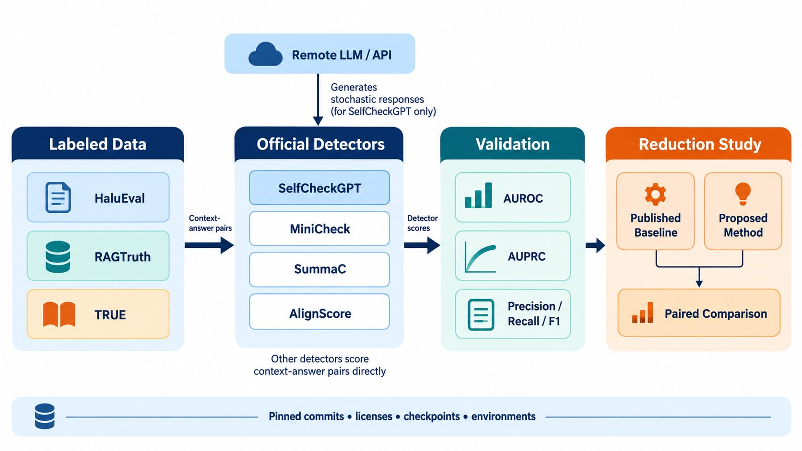
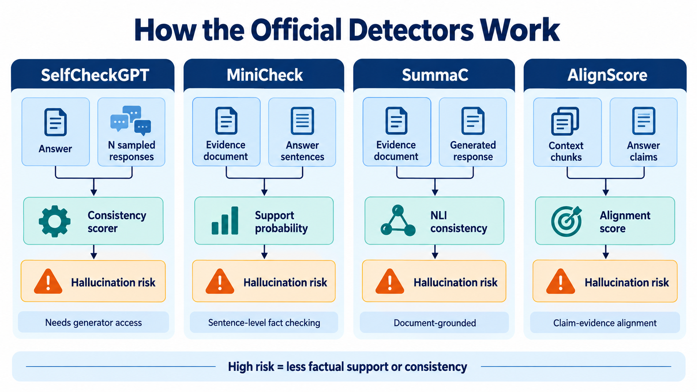

# Reproducible LLM Hallucination Research Harness

[](https://www.python.org/)
[](provenance/sources.yaml)
[](config.remote.example.yaml)
[](#research-status)

A lightweight research harness for validating published hallucination detectors
before using them to compare hallucination-reduction methods. The repository
does not recreate detector algorithms: it connects pinned official packages to
one consistent data and evaluation interface.

> **Important:** source integration is complete, but runtime reproduction and
> research results are still pending. Synthetic examples are smoke fixtures,
> not evidence for a paper.



*Figure 1. Intended research workflow. The remote generator is needed only for
SelfCheckGPT sampling. Every reported run must preserve its source, license,
checkpoint, and environment metadata.*

## Research objective

The project separates two questions that should not be mixed:

1. **Detector validation:** Can a published detector distinguish fixed factual
   and hallucinated responses on held-out labeled data?
2. **Reduction evaluation:** After the detector is validated, does a published
   mitigation method improve paired model outputs without unacceptable losses
   in correctness, relevance, latency, or cost?

No LLM or detector checkpoint is downloaded by the default controller workflow.
Generation may run on another computer through Ollama or through an
OpenAI-compatible API.

## Official detectors



*Figure 2. The detector families are related but not interchangeable.
SelfCheckGPT measures consistency across sampled generations; MiniCheck,
SummaC, and AlignScore measure support against supplied evidence.*

| Method | What the official method measures | Paper | Code | License | Current status |
|---|---|---|---|---|---|
| **SelfCheckGPT** | Sentence-level inconsistency against stochastic responses from the same generator | [Manakul et al., 2023](https://aclanthology.org/2023.emnlp-main.557/) | [Official repository](https://github.com/potsawee/selfcheckgpt) | MIT | Adapter integrated; runtime validation pending |
| **MiniCheck** | Sentence-level factual support from a grounding document | [Tang et al., 2024](https://aclanthology.org/2024.emnlp-main.499/) | [Official repository](https://github.com/Liyan06/MiniCheck) | Apache-2.0 | Adapter integrated; runtime validation pending |
| **SummaC** | NLI-based document–response consistency | [Laban et al., 2022](https://aclanthology.org/2022.tacl-1.10/) | [Official repository](https://github.com/tingofurro/summac) | Apache-2.0 | Adapter integrated; isolated environment required |
| **AlignScore** | Information alignment between context chunks and response claims | [Zha et al., 2023](https://aclanthology.org/2023.acl-long.634/) | [Official repository](https://github.com/yuh-zha/AlignScore) | MIT | Adapter integrated; checkpoint and isolated environment required |

The local files under `detectors/` are adapters only. Exact reviewed commits are
recorded in [`provenance/sources.yaml`](provenance/sources.yaml). Model and
tokenizer artifact hashes must also be recorded before publishing results.

The previous token-overlap, semantic-cosine, prompted LLM-judge, BERT stochastic,
and ensemble implementations are excluded from the active imports,
configuration, and runner. They are not alternate names for the official
methods above.

## Evaluation protocol

For every source example, the loader creates a matched factual case
(`label = 0`) and hallucinated case (`label = 1`). Detectors score the same fixed
responses; they do not generate replacement answers during validation.

The planned protocol is:

1. split data at the original paired-example level;
2. calibrate thresholds on the validation split only;
3. freeze detector versions, checkpoints, thresholds, and seeds;
4. report AUROC, AUPRC, precision, recall, F1, and failure counts on held-out data;
5. confirm a representative subset through blinded human review;
6. only then use the detector in paired reduction experiments.

### Candidate datasets

| Dataset | Role | Paper | Official source | Status |
|---|---|---|---|---|
| **HaluEval** | Matched factual and hallucinated QA responses | [Li et al., 2023](https://aclanthology.org/2023.emnlp-main.397/) | [RUCAIBox/HaluEval](https://github.com/RUCAIBox/HaluEval) | Selected; external data preparation required |
| **RAGTruth** | Human response- and span-level RAG hallucination annotations | [Niu et al., 2024](https://aclanthology.org/2024.acl-long.585/) | [ParticleMedia/RAGTruth](https://github.com/ParticleMedia/RAGTruth) | Planned |
| **TRUE** | Factual-consistency meta-evaluation collection | [Honovich et al., 2022](https://aclanthology.org/2022.naacl-main.287/) | [google-research/true](https://github.com/google-research/true) | Planned |
| **LLM-AggreFact** | Aggregated grounded fact-checking benchmark released with MiniCheck | [Tang et al., 2024](https://aclanthology.org/2024.emnlp-main.499/) | [Hugging Face dataset](https://huggingface.co/datasets/lytang/LLM-AggreFact) | Revision must be pinned before use |

## Reduction-method status

No reduction algorithm is currently active. This prevents locally written
prompting code from being mislabeled as a reproduction.

| Candidate | Official source | Decision |
|---|---|---|
| **Self-Refine** | [Paper](https://proceedings.neurips.cc/paper_files/paper/2023/hash/91edff07232fb1b55a505a9e9f6c0ff3-Abstract-Conference.html) · [Code](https://github.com/madaan/self-refine) | Reference only; upstream tasks and prompts are specialized |
| **Self-RAG** | [Paper](https://openreview.net/forum?id=hSyW5go0v8) · [Code](https://github.com/AkariAsai/self-rag) | Reference only; requires the trained model, reflection tokens, and retrieval workflow |
| **RARR** | [Paper](https://aclanthology.org/2023.acl-long.910/) · [Code](https://github.com/anthonywchen/RARR) | Reference only; repository license must be clarified before vendoring |
| **AWS contextual grounding** | [Service documentation](https://docs.aws.amazon.com/bedrock/latest/userguide/guardrails-contextual-grounding-check.html) · [AWS examples](https://github.com/aws-samples/responsible_ai_reduce_hallucinations_for_genai_apps) | Possible managed-service baseline; report separately from open-source methods |

The full decision record is in
[`docs/MITIGATION_METHODS.md`](docs/MITIGATION_METHODS.md).

## Running safely

Configuration and data check on the development computer—no detector model or
API request:

```bash
python main.py --dry-run
```

Lightweight official SelfCheckGPT n-gram integration check in Google Colab:

```bash
pip install -r requirements-colab-smoke.txt
python official_smoke.py selfcheckgpt
```

MiniCheck in a GPU Colab runtime:

```bash
pip install -r requirements-colab-minicheck.txt
python official_smoke.py minicheck
python main.py --detectors minicheck --output results/colab-minicheck
```

Copy-ready notebook cells and environment warnings are in
[`docs/COLAB.md`](docs/COLAB.md).

## Remote model or API

SelfCheckGPT requires repeated generations. Configure either remote Ollama or an
OpenAI-compatible `/chat/completions` endpoint using
[`config.remote.example.yaml`](config.remote.example.yaml). API keys are read
from the environment variable named by `api_key_env`; secrets and model weights
must never be committed.

MiniCheck, SummaC, and AlignScore evaluate existing context–answer pairs and do
not need access to the generator.

## Research status

| Component | Status |
|---|---|
| Official source review and immutable Git revisions | Complete |
| Thin adapters and common result schema | Complete |
| Local/API generator connectivity | Implemented; execution test pending |
| Colab smoke workflow | Prepared; execution test pending |
| Detector checkpoint/runtime reproduction | Pending |
| Held-out official-dataset validation | Pending |
| Official reduction-method integration | Not started |
| Proposed-method comparison | Not started |

This table should be updated with evidence after each successful run. A method
is not “reproduced” merely because its adapter imports successfully.

## Repository structure

```text
assets/diagrams/                 original README figures
benchmark/runner.py              fixed-response orchestration
benchmark/detector_validation.py labeled evaluation metrics
data/datasets.py                 normalized paired cases
detectors/                       thin upstream-package adapters
models/                          remote Ollama, API, and replay adapters
provenance/sources.yaml          commits, licenses, and integration status
docs/COLAB.md                    copy/paste Colab workflow
docs/REPRODUCIBILITY.md          provenance and experiment policy
docs/MITIGATION_METHODS.md       reduction-method decisions
CITATION.bib                     paper citations used by this project
```

## Reproducibility and citations

- Source provenance: [`provenance/sources.yaml`](provenance/sources.yaml)
- Method details: [`METHOD_SOURCES.md`](METHOD_SOURCES.md)
- Reproducibility policy: [`docs/REPRODUCIBILITY.md`](docs/REPRODUCIBILITY.md)
- BibTeX references: [`CITATION.bib`](CITATION.bib)

When reporting a detector, cite its original paper and official repository—not
this adapter as the algorithm. The two diagrams above are original explanatory
graphics for this repository and are not copied from any cited paper.
