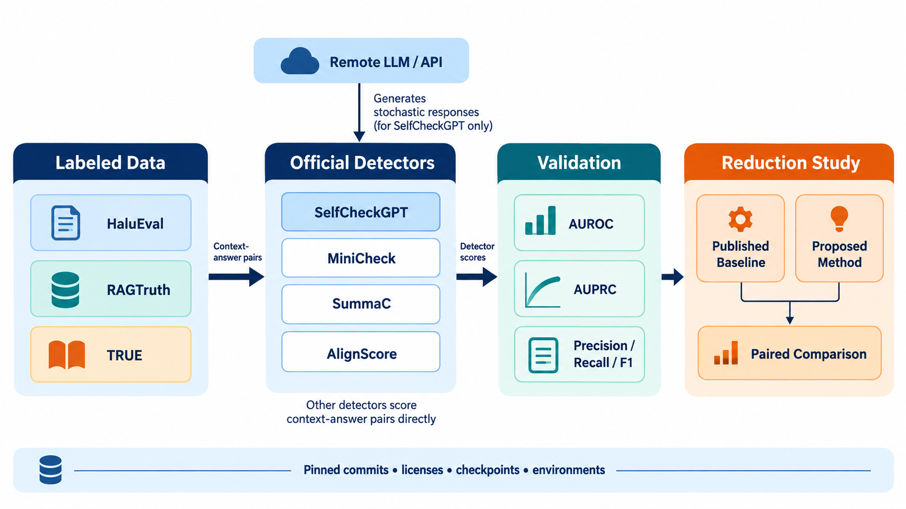
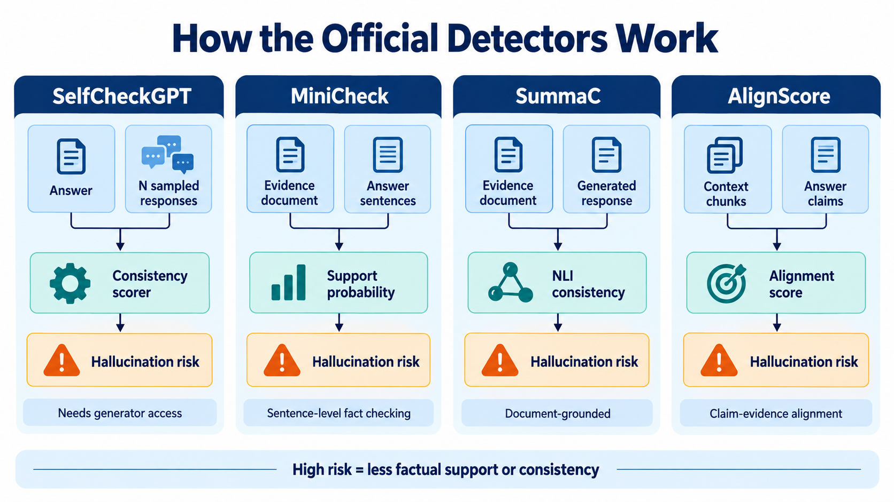

# Reproducible LLM Hallucination Research Harness

[](https://www.python.org/)
[](provenance/sources.yaml)
[](config.yaml)
[](#research-status)

A lightweight research harness for validating published hallucination detectors
before using them to compare hallucination-reduction methods. The repository
does not recreate detector algorithms: it connects pinned official packages to
one consistent data and evaluation interface.

> **Important:** source integration is complete, but runtime reproduction and
> research results are still pending. Synthetic examples are smoke fixtures,
> not evidence for a paper.



*Figure 1. Intended research workflow. The local Ollama generators are needed
for SelfCheckGPT sampling and the reduction stage. Every reported run must
preserve its source, license, checkpoint, and environment metadata.*

## Research objective

The project separates two questions that should not be mixed:

1. **Detector validation:** Can a published detector distinguish fixed factual
   and hallucinated responses on held-out labeled data?
2. **Reduction evaluation:** After the detector is validated, does a published
   mitigation method improve paired model outputs without unacceptable losses
   in correctness, relevance, latency, or cost?

Every run first downloads (and checksum-verifies) any missing data, pulls
missing Ollama models, and runs a one-case preflight of the whole pipeline;
see [`docs/HOW_TO_RUN.md`](docs/HOW_TO_RUN.md#1-how-every-run-protects-your-time).
Everything runs locally: the generator models are served by Ollama, and the
detectors run in local Python environments.

## Official detectors



*Figure 2. The detector families are related but not interchangeable.
SelfCheckGPT measures consistency across sampled generations; MiniCheck,
SummaC, and AlignScore measure support against supplied evidence.*

Every detector below runs from its official package at a pinned version; the
files under `detectors/` are thin adapters. Full details, including every
setting chosen and why: [`METHOD_SOURCES.md`](METHOD_SOURCES.md).

| Method | What it measures | Paper | Code | License |
|---|---|---|---|---|
| **SelfCheckGPT** (n-gram, BERTScore, NLI, LLM prompt) | Consistency of an answer with other answers the same model gives to the same prompt | [Manakul et al., 2023](https://aclanthology.org/2023.emnlp-main.557/) | [potsawee/selfcheckgpt](https://github.com/potsawee/selfcheckgpt) | MIT |
| **UQLM** consistency (semantic entropy, non-contradiction, entailment, cosine, exact match, BERTScore) | Agreement between the answer and the model's sampled answers | [Bouchard et al., 2025](https://arxiv.org/abs/2507.06196); semantic entropy: [Farquhar et al., 2024](https://doi.org/10.1038/s41586-024-07421-0) | [cvs-health/uqlm](https://github.com/cvs-health/uqlm) | Apache-2.0 |
| **UQLM LLM-as-a-judge** | A separate judge model grades the answer against the context | [Bouchard et al., 2025](https://arxiv.org/abs/2507.06196) | [cvs-health/uqlm](https://github.com/cvs-health/uqlm) | Apache-2.0 |
| **MiniCheck** | Sentence-level support from the grounding document | [Tang et al., 2024](https://aclanthology.org/2024.emnlp-main.499/) | [Liyan06/MiniCheck](https://github.com/Liyan06/MiniCheck) | Apache-2.0 |
| **SummaC** | NLI-based document–answer consistency | [Laban et al., 2022](https://aclanthology.org/2022.tacl-1.10/) | [tingofurro/summac](https://github.com/tingofurro/summac) | Apache-2.0 |
| **AlignScore** (opt-in) | Information alignment between context and answer | [Zha et al., 2023](https://aclanthology.org/2023.acl-long.634/) | [yuh-zha/AlignScore](https://github.com/yuh-zha/AlignScore) | MIT |

Earlier versions of this repository had locally written token-overlap,
semantic-cosine, LLM-judge and BERT-stochastic detectors (after an AWS blog
post that publishes no code). They were removed; the published methods they
imitated now run from official code above.

## Evaluation protocol

Each question comes with answers whose label is known (`label = 0` faithful,
`label = 1` hallucinated): HaluEval's correct/hallucinated pairs, RAGTruth's
human-annotated answers from six LLMs, and HaluBench's PASS/FAIL answers.
Detectors score these fixed answers; they do not generate replacements during
validation.

The planned protocol is:

1. split data at the original paired-example level;
2. calibrate thresholds on the validation split only;
3. freeze detector versions, checkpoints, thresholds, and seeds;
4. report AUROC, AUPRC, precision, recall, F1, and failure counts on held-out data;
5. confirm a representative subset through blinded human review;
6. only then use the detector in paired reduction experiments.

### Datasets

| Dataset | Role | Paper | Official source | Status |
|---|---|---|---|---|
| **HaluEval** (QA, dialogue, summarization) | Matched correct/hallucinated answers | [Li et al., 2023](https://aclanthology.org/2023.emnlp-main.397/) | [RUCAIBox/HaluEval](https://github.com/RUCAIBox/HaluEval) | In use |
| **RAGTruth** (QA, summaries, data-to-text) | Real answers from 6 LLMs with human span-level labels (test split) | [Niu et al., 2024](https://aclanthology.org/2024.acl-long.585/) | [ParticleMedia/RAGTruth](https://github.com/ParticleMedia/RAGTruth) | In use |
| **HaluBench** (DROP, FinanceBench, CovidQA, PubMedQA) | PASS/FAIL-labeled answers in finance, biomedical and numeric reading | [Ravi et al., 2024](https://arxiv.org/abs/2407.08488) | [PatronusAI/HaluBench](https://huggingface.co/datasets/PatronusAI/HaluBench) | In use (CC-BY-NC-2.0, research only) |
| **LLM-AggreFact** | Grounded fact-checking benchmark released with MiniCheck | [Tang et al., 2024](https://aclanthology.org/2024.emnlp-main.499/) | [Hugging Face](https://huggingface.co/datasets/lytang/LLM-AggreFact) | Not used: gated download (login) |
| **TRUE** | Factual-consistency meta-evaluation collection | [Honovich et al., 2022](https://aclanthology.org/2022.naacl-main.287/) | [google-research/true](https://github.com/google-research/true) | Not used: its datasets must be collected from many separate sources |

All data is downloaded by the run from its pinned source and SHA-256 verified.

## Reduction methods

Every method answers the same questions with the same models, and every
answer is compared with the model's own grounded baseline answer on the same
question, by every detector. Each row of the results carries a
`reproduction_status` saying exactly what the method is.

| Method | Source | Status |
|---|---|---|
| **closed_book** vs. baseline | RAG, [Lewis et al., 2020](https://arxiv.org/abs/2005.11401) | Ablation: the same question without the context shows what retrieval adds |
| **greedy** | — | Decoding setting (temperature 0), not a published method |
| **self_refine_adapted** | [Madaan et al., 2023](https://arxiv.org/abs/2303.17651) · [code](https://github.com/madaan/self-refine) | Local inspired adaptation (official code is task-specific) |
| **cove_adapted** | [Dhuliawala et al., 2023](https://arxiv.org/abs/2309.11495) | Local implementation of the paper's method; no official code exists |
| **uqlm_best_response** | [UQLM](https://github.com/cvs-health/uqlm) semantic entropy | Official implementation |
| Self-RAG | [code](https://github.com/AkariAsai/self-rag) | Not used: needs its own trained model |
| RARR | [code](https://github.com/anthonywchen/RARR) | Not used: no license declared, needs a search API |

The full decision record is in
[`docs/MITIGATION_METHODS.md`](docs/MITIGATION_METHODS.md).

## Running

Setup, the smoke test, the full run, and what every output file contains are
in [`docs/HOW_TO_RUN.md`](docs/HOW_TO_RUN.md). In short:

```bash
pip install -r requirements.txt       # the one install; Ollama itself is a system install
python main.py --detectors selfcheckgpt --reduce \
  --runs 2 --max-samples 2 --n-samples 2 --max-iterations 1 \
  --output results/smoke-test         # smoke test: same outputs as the full run
python scripts/run_full.py            # the full run: config.yaml's `run:` block
```

How big a run is (runs, samples per dataset, detectors, SelfCheckGPT
samples, reduction rounds) is set in one place: the `run:` block at the top
of [`config.yaml`](config.yaml).

Offline tests (no LLM, no downloads) check adapter contracts, metrics,
reports, downloads/checksums, provenance and documentation links:

```bash
python -m unittest discover -s tests -v
```

## Research status

| Component | Status |
|---|---|
| Official source review and immutable Git revisions | Complete |
| Thin adapters and common result schema | Complete |
| Detector runtime | SelfCheckGPT (all 4 scorers) and UQLM (all scorers + judge) verified on real data; MiniCheck/SummaC/AlignScore verified only through their adapters and the preflight |
| Held-out official-dataset validation | Pending |
| Reduction methods | closed_book, greedy, self_refine_adapted, cove_adapted, uqlm_best_response; engineering comparison only, not Stage B evidence |
| Proposed-method comparison | Not started |

This table should be updated with evidence after each successful run. A method
is not “reproduced” merely because its adapter imports successfully.

## Repository structure

```text
config.yaml                      the one configuration (run plan at the top)
requirements.txt                 the one install (controller + SelfCheckGPT)
requirements/                    isolated per-detector envs, installed by run_full.py
assets/diagrams/                 original README figures
benchmark/runner.py              fixed-response orchestration (all selected models)
benchmark/detector_validation.py labeled evaluation metrics
benchmark/reduction_runner.py    Stage B: paired baseline vs. reduced-answer comparison
data/datasets.py                 normalized paired cases
detectors/                       thin upstream-package adapters
reducers/                        self_refine (adapted), cove (local impl.), uqlm_best_response (official)
detectors/sampling.py            samples shared by every sampling-based detector
models/prompts.py                the grounded / closed-book prompts every stage shares
models/                          local Ollama adapter (+ replay model for tests)
utils/console.py                 terminal layout, progress bars, run.log
utils/run_manifest.py            run_manifest.json / config_used.yaml / environment.txt
scripts/run_full.py              runs every detector (own venv) + reduction, one report
reporting/                       per-run + combined reports: report.docx/.html/REPORT.md, charts, tables
scripts/generate_report.py       rebuild reports for an existing results folder
utils/resources.py               pinned downloads (HaluEval, AlignScore ckpt) + checksums
benchmark/preflight.py           one-case check of every detector/model before long stages
scripts/prepare_halueval.py      optional: pre-download HaluEval only
provenance/sources.yaml          commits, licenses, and integration status
docs/REPRODUCIBILITY.md          provenance and experiment policy
docs/MITIGATION_METHODS.md       reduction-method decisions
CITATION.bib                     paper citations used by this project
```

## Reproducibility and citations

- Source provenance: [`provenance/sources.yaml`](provenance/sources.yaml)
- Method details: [`METHOD_SOURCES.md`](METHOD_SOURCES.md)
- Reproducibility policy: [`docs/REPRODUCIBILITY.md`](docs/REPRODUCIBILITY.md)
- BibTeX references: [`CITATION.bib`](CITATION.bib)

When reporting a detector, cite its original paper and official repository—not
this adapter as the algorithm. The two diagrams above are original explanatory
graphics for this repository and are not copied from any cited paper.
