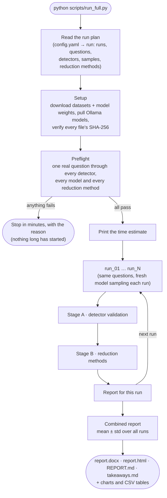
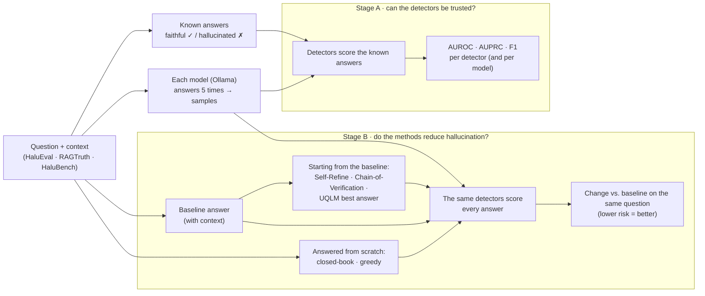
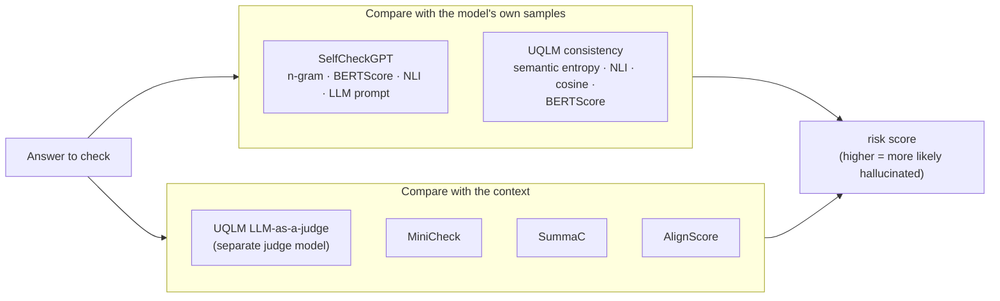

# Reproducible LLM Hallucination Research Harness

[](https://www.python.org/)
[](provenance/sources.yaml)
[](config.yaml)
[](#research-status)

A local research harness that answers two questions, in this order:

1. **Which hallucination detectors can be trusted?** Every detector scores
   answers whose label is already known (faithful or hallucinated), and we
   measure how well it separates them.
2. **Which reduction methods actually reduce hallucination?** Every model
   answers the same questions with and without each method, and the same
   detectors compare the answers.

Every detector, reduction method and dataset comes from its **official,
citable source**, pinned to an exact version; this repository only connects
them, runs them the same way, and reports the results. Everything runs on one
machine: the language models through Ollama, the detectors in local Python
environments.

> **Status:** the pipeline is complete and verified end to end; the research
> results are still to be produced by a full run (see
> [Research status](#research-status)).

## How a run works


```mermaid
flowchart TD
    start(["python scripts/run_full.py"]) --> plan["Read the run plan<br/>(config.yaml → run: runs, questions,<br/>detectors, samples, reduction methods)"]
    plan --> setup["Setup<br/>download datasets + model weights, pull Ollama models,<br/>verify every file's SHA-256"]
    setup --> pre["Preflight<br/>one real question through every detector,<br/>every model and every reduction method"]
    pre -->|anything fails| stop(["Stop in minutes, with the reason<br/>(nothing long has started)"])
    pre -->|all pass| est["Print the time estimate"]
    est --> runs["run_01 … run_N<br/>(same questions, fresh model sampling each run)"]
    runs --> a["Stage A · detector validation"]
    a --> b["Stage B · reduction methods"]
    b --> rep["Report for this run"]
    rep -->|next run| runs
    rep --> comb["Combined report<br/>mean ± std over all runs"]
    comb --> out(["report.docx · report.html · REPORT.md · takeaways.md<br/>+ charts and CSV tables"])
```

`main.py` runs this flow for one Python environment. `scripts/run_full.py`
runs it once per environment (the detectors' official packages need
conflicting library versions) and then combines everything; details in
[`docs/ARCHITECTURE.md`](docs/ARCHITECTURE.md).

## What happens to one question


```mermaid
flowchart LR
    q["Question + context<br/>(HaluEval · RAGTruth · HaluBench)"]
    lab["Known answers<br/>faithful ✓ / hallucinated ✗"]
    gen["Each model (Ollama)<br/>answers 5 times → samples"]

    subgraph A["Stage A · can the detectors be trusted?"]
        det1["Detectors score the known answers"]
        met["AUROC · AUPRC · F1<br/>per detector (and per model)"]
        det1 --> met
    end

    subgraph B["Stage B · do the methods reduce hallucination?"]
        base["Baseline answer<br/>(with context)"]
        own["Answered from scratch:<br/>closed-book · greedy"]
        fix["Starting from the baseline:<br/>Self-Refine · Chain-of-Verification ·<br/>UQLM best answer"]
        det2["The same detectors score<br/>every answer"]
        delta["Change vs. baseline on the same question<br/>(lower risk = better)"]
        base --> fix --> det2
        own --> det2
        base --> det2
        det2 --> delta
    end

    q --> lab --> det1
    q --> gen --> det1
    gen --> det2
    q --> base
    q --> own
```

Every detector scores every answer, but the report judges the reduction
methods only with the detectors that **passed Stage A** (AUROC ≥ 0.65), and
gives each method's change in risk with a 95% confidence interval.

The samples a model draws for a question are drawn **once** and shared by
every sampling-based detector, by every known answer to that question, and
by every reduction method's answer, so the comparisons use identical
evidence. (The one exception: when the UQLM best-response method picks one
of the samples, that answer is scored without its own copies; see
[`METHOD_SOURCES.md`](METHOD_SOURCES.md#reduction-stage-b).)

## Research objective

The project separates two questions that should not be mixed:

1. **Detector validation:** Can a published detector distinguish fixed factual
   and hallucinated responses on held-out labeled data?
2. **Reduction evaluation:** After the detector is validated, does a published
   mitigation method improve paired model outputs without unacceptable losses
   in correctness, relevance, latency, or cost?

## Official detectors


```mermaid
flowchart LR
    ans["Answer to check"]
    subgraph S["Compare with the model's own samples"]
        sc["SelfCheckGPT<br/>n-gram · BERTScore · NLI · LLM prompt"]
        uq["UQLM consistency<br/>semantic entropy · NLI · cosine ·<br/>BERTScore"]
    end
    subgraph C["Compare with the context"]
        jd["UQLM LLM-as-a-judge<br/>(separate judge model)"]
        mc["MiniCheck"]
        su["SummaC"]
        al["AlignScore"]
    end
    ans --> S
    ans --> C
    S --> r["risk score<br/>(higher = more likely hallucinated)"]
    C --> r
```

*The detector families answer different questions: the sampling-based ones
ask "does this answer agree with what the model says when asked again?", the
context-based ones ask "is this answer supported by the supplied context?".
Every score is oriented the same way.*

Every detector below runs from its official package at a pinned version; the
files under `detectors/` are thin adapters. Full details, including every
setting chosen and why: [`METHOD_SOURCES.md`](METHOD_SOURCES.md).

| Method | What it measures | Paper | Code | License |
|---|---|---|---|---|
| **SelfCheckGPT** (n-gram, BERTScore, NLI, LLM prompt) | Consistency of an answer with other answers the same model gives to the same prompt | [Manakul et al., 2023](https://aclanthology.org/2023.emnlp-main.557/) | [potsawee/selfcheckgpt](https://github.com/potsawee/selfcheckgpt) | MIT |
| **UQLM** consistency (semantic entropy, non-contradiction, entailment, cosine, BERTScore) | Agreement between the answer and the model's sampled answers | [Bouchard et al., 2025](https://arxiv.org/abs/2507.06196); semantic entropy: [Farquhar et al., 2024](https://doi.org/10.1038/s41586-024-07421-0) | [cvs-health/uqlm](https://github.com/cvs-health/uqlm) | Apache-2.0 |
| **UQLM LLM-as-a-judge** | A separate judge model grades the answer against the context | [Bouchard et al., 2025](https://arxiv.org/abs/2507.06196) | [cvs-health/uqlm](https://github.com/cvs-health/uqlm) | Apache-2.0 |
| **MiniCheck** | Sentence-level support from the grounding document | [Tang et al., 2024](https://aclanthology.org/2024.emnlp-main.499/) | [Liyan06/MiniCheck](https://github.com/Liyan06/MiniCheck) | Apache-2.0 |
| **SummaC** | NLI-based document–answer consistency | [Laban et al., 2022](https://aclanthology.org/2022.tacl-1.10/) | [tingofurro/summac](https://github.com/tingofurro/summac) | Apache-2.0 |
| **AlignScore** (opt-in) | Information alignment between context and answer | [Zha et al., 2023](https://aclanthology.org/2023.acl-long.634/) | [yuh-zha/AlignScore](https://github.com/yuh-zha/AlignScore) | MIT |

Earlier versions of this repository had locally written token-overlap,
semantic-cosine, LLM-judge and BERT-stochastic detectors (after an AWS blog
post that publishes no code). They were removed; the published methods they
imitated now run from official code above.

## Evaluation protocol

Each question comes with answers whose label is known (`label = 0` faithful,
`label = 1` hallucinated): HaluEval's correct/hallucinated pairs, RAGTruth's
human-annotated answers from six LLMs, and HaluBench's PASS/FAIL answers.
Detectors score these fixed answers; they do not generate replacements during
validation.

The planned protocol is:

1. split data at the original paired-example level;
2. calibrate thresholds on the validation split only;
3. freeze detector versions, checkpoints, thresholds, and seeds;
4. report AUROC, AUPRC, precision, recall, F1, and failure counts on held-out data;
5. confirm a representative subset through blinded human review;
6. only then use the detector in paired reduction experiments.

### Datasets

| Dataset | Role | Paper | Official source | Status |
|---|---|---|---|---|
| **HaluEval** (QA, dialogue, summarization) | Matched correct/hallucinated answers | [Li et al., 2023](https://aclanthology.org/2023.emnlp-main.397/) | [RUCAIBox/HaluEval](https://github.com/RUCAIBox/HaluEval) | In use |
| **RAGTruth** (QA, summaries, data-to-text) | Real answers from 6 LLMs with human span-level labels (test split) | [Niu et al., 2024](https://aclanthology.org/2024.acl-long.585/) | [ParticleMedia/RAGTruth](https://github.com/ParticleMedia/RAGTruth) | In use |
| **HaluBench** (DROP, FinanceBench, CovidQA, PubMedQA) | PASS/FAIL-labeled answers in finance, biomedical and numeric reading | [Ravi et al., 2024](https://arxiv.org/abs/2407.08488) | [PatronusAI/HaluBench](https://huggingface.co/datasets/PatronusAI/HaluBench) | In use (CC-BY-NC-2.0, research only) |
| **LLM-AggreFact** | Grounded fact-checking benchmark released with MiniCheck | [Tang et al., 2024](https://aclanthology.org/2024.emnlp-main.499/) | [Hugging Face](https://huggingface.co/datasets/lytang/LLM-AggreFact) | Not used: gated download (login) |
| **TRUE** | Factual-consistency meta-evaluation collection | [Honovich et al., 2022](https://aclanthology.org/2022.naacl-main.287/) | [google-research/true](https://github.com/google-research/true) | Not used: its datasets must be collected from many separate sources |

All data is downloaded by the run from its pinned source and SHA-256 verified.

## Reduction methods

Every method answers the same questions with the same models, and every
answer is compared with the model's own grounded baseline answer on the same
question, by every detector. Each row of the results carries a
`reproduction_status` saying exactly what the method is.

| Method | Source | Status |
|---|---|---|
| **closed_book** vs. baseline | RAG, [Lewis et al., 2020](https://arxiv.org/abs/2005.11401) | Ablation: the same question without the context shows what retrieval adds |
| **greedy** | — | Decoding setting (temperature 0), not a published method |
| **self_refine_adapted** | [Madaan et al., 2023](https://arxiv.org/abs/2303.17651) · [code](https://github.com/madaan/self-refine) | Local inspired adaptation (official code is task-specific) |
| **cove_adapted** | [Dhuliawala et al., 2023](https://arxiv.org/abs/2309.11495) | Local implementation of the paper's method; no official code exists |
| **uqlm_best_response** | [UQLM](https://github.com/cvs-health/uqlm) semantic entropy | Official implementation |
| Self-RAG | [code](https://github.com/AkariAsai/self-rag) | Not used: needs its own trained model |
| RARR | [code](https://github.com/anthonywchen/RARR) | Not used: no license declared, needs a search API |

The full decision record is in
[`docs/MITIGATION_METHODS.md`](docs/MITIGATION_METHODS.md).

## Running

Setup, the smoke test, the full run, and what every output file contains are
in [`docs/HOW_TO_RUN.md`](docs/HOW_TO_RUN.md). In short:

```bash
pip install -r requirements.txt       # the one install; Ollama itself is a system install
python scripts/run_full.py --smoke    # smoke test: the whole experiment with tiny numbers
python scripts/run_full.py --runs 5   # the full experiment: 5 independent runs
```

The result folder has one complete folder per run (`run_01/`, `run_02/`, …,
each with its own report and data) and a `combined/` folder with all runs
together. How big a run is (runs, questions per dataset, detectors, samples,
reduction rounds) is set in one place: the `run:` block at the top of
[`config.yaml`](config.yaml).

Offline tests (no LLM, no downloads) check adapter contracts, metrics,
reports, downloads/checksums, provenance and documentation links:

```bash
python -m unittest discover -s tests -v
```

## Research status

| Component | Status |
|---|---|
| Official source review and immutable Git revisions | Complete |
| Thin adapters and common result schema | Complete |
| Detector runtime | SelfCheckGPT (all 4 scorers) and UQLM (all scorers + judge) verified on real data; MiniCheck/SummaC/AlignScore verified only through their adapters and the preflight |
| Held-out official-dataset validation | Pending |
| Reduction methods | closed_book, greedy, self_refine_adapted, cove_adapted, uqlm_best_response; engineering comparison only, not Stage B evidence |
| Proposed-method comparison | Not started |

This table should be updated with evidence after each successful run. A method
is not “reproduced” merely because its adapter imports successfully.

## Repository structure

```text
config.yaml                      the one configuration (run plan at the top)
requirements.txt                 the one install: controller + SelfCheckGPT + UQLM ("core")
requirements/                    isolated environments for MiniCheck / SummaC / AlignScore
main.py                          one environment: setup → preflight → runs → reports
scripts/run_full.py              every environment, then the combined report
scripts/generate_report.py       rebuild reports for an existing results folder
scripts/prepare_halueval.py      optional: pre-download HaluEval only
data/datasets.py                 HaluEval, RAGTruth, HaluBench loaders → questions + labeled answers
models/                          Ollama adapter, shared prompts (+ replay model for tests)
detectors/                       thin adapters around the official detector packages
detectors/sampling.py            samples shared by every sampling-based detector
reducers/                        Self-Refine (adapted), CoVe (local impl.), UQLM best response (official)
benchmark/runner.py              Stage A: every detector on the labeled answers
benchmark/reduction_runner.py    Stage B: every method's answer, paired with the baseline
benchmark/preflight.py           one-question check of everything before long stages
benchmark/detector_validation.py AUROC / AUPRC / F1 / failures
reporting/                       per-run + combined reports (docx / html / md), charts, tables
utils/resources.py               pinned, checksummed downloads (data, weights)
utils/run_manifest.py            run_manifest.json / config_used.yaml / environment.txt
utils/console.py                 terminal layout, progress bars, run.log
provenance/sources.yaml          commits, licenses, and integration status of every source
docs/ARCHITECTURE.md             how the pieces fit together (diagrams)
docs/HOW_TO_RUN.md               setup, smoke test, full run, every output file
docs/REPRODUCIBILITY.md          provenance and experiment policy
docs/MITIGATION_METHODS.md       reduction-method decisions
CITATION.bib                     paper citations used by this project
```

## Reproducibility and citations

- Source provenance: [`provenance/sources.yaml`](provenance/sources.yaml)
- Method details: [`METHOD_SOURCES.md`](METHOD_SOURCES.md)
- Reproducibility policy: [`docs/REPRODUCIBILITY.md`](docs/REPRODUCIBILITY.md)
- BibTeX references: [`CITATION.bib`](CITATION.bib)

When reporting a detector or method, cite its original paper and official
repository, not this adapter as the algorithm. The diagrams in this README are
original explanatory graphics for this repository.
