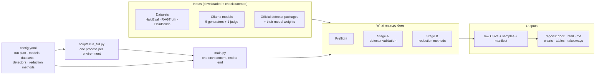
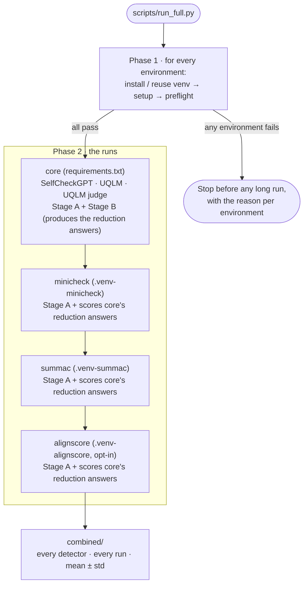
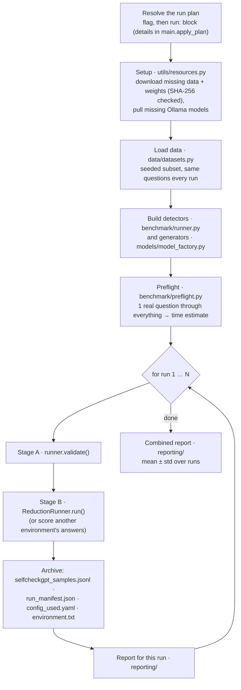
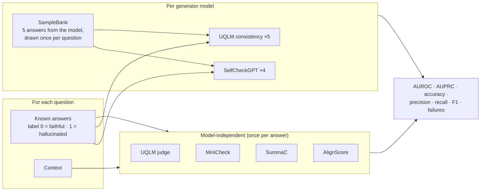
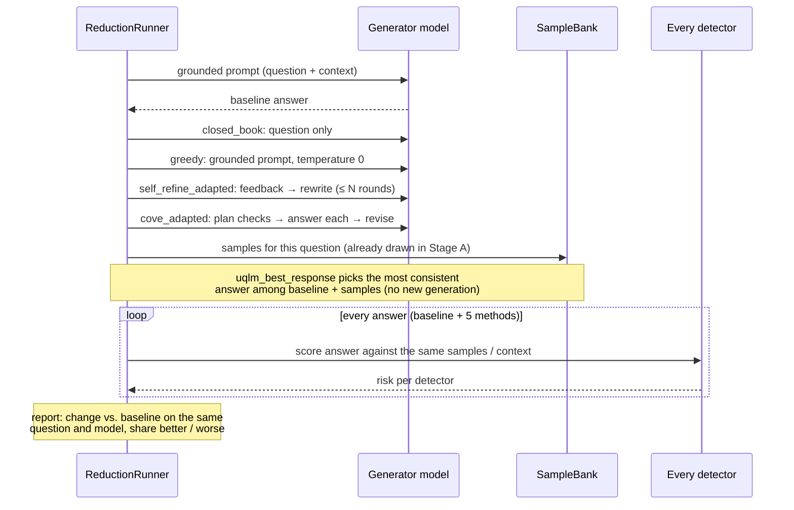

# Architecture

How the pieces fit together, from the command you type to the report you
read. For setup and commands see [`HOW_TO_RUN.md`](HOW_TO_RUN.md); for where
each method comes from see [`../METHOD_SOURCES.md`](../METHOD_SOURCES.md).

## 1. The big picture



## 2. Environments

The official detector packages pin conflicting versions of `torch` and
`transformers`, so they cannot all live in one Python environment.
`scripts/run_full.py` therefore runs `main.py` once per environment and
merges everything at the end.



`core` runs first because the other environments score the answers it
produced (`--score-reduction-from core`). The reports join those scores back
onto core's answers by run, question, model and method.

## 3. Inside `main.py`



## 4. Stage A: can the detectors be trusted?

Every question comes with answers whose label is known. Detectors that do
not need a model score each answer once; the sampling-based detectors run one
model at a time over every answer, so Ollama keeps a single model loaded.



The model-independent scores are deterministic, so later runs reuse the first
run's scores instead of recomputing them; only the sampling-based detectors
vary between runs.

## 5. Stage B: do the methods reduce hallucination?



The report then judges each method only with the detectors that passed
Stage A (AUROC ≥ 0.65): the mean change vs. the baseline per question × model
pair, with a 95% bootstrap confidence interval. Every detector's view is
still in the appendix and the CSVs.

Two details keep this comparison fair:

- **Same evidence.** Every answer to a question is scored against the same
  samples, so differences come from the answers, not from new randomness.
- **Leave-one-out.** When `uqlm_best_response` picks one of the samples, every
  exact copy of it is taken out of its evidence and the baseline answer is
  added; otherwise it would be scored against a copy of itself.

## 6. What a results folder contains

```text
<output>/
  run_01/ … run_N/        one complete, independent run each
    detector_validation_raw.csv      every labeled answer × every detector
    detector_validation_summary.csv  metrics per detector (per model where relevant)
    reduction_comparison.csv         every method's answer × every detector (core)
    reduction_scores.csv             another environment's scores of those answers
    selfcheckgpt_samples.jsonl       every sampled answer used as evidence
    run_manifest.json · config_used.yaml · environment.txt
    report.docx · report.html · REPORT.md · takeaways.md · charts/ · tables/
  combined/                mean ± std over runs: the same reports + all rows
  run.log                  full log with tracebacks
```

`scripts/run_full.py` puts one such folder per environment (`core/`,
`minicheck/`, …) and adds a top-level `combined/` over all of them.

## 7. Design rules

| Rule | Where | Why |
|---|---|---|
| Official code only; local implementations labeled | `detectors/`, `reducers/`, `reproduction_status` column | results must be citable |
| Every download pinned and SHA-256 checked | `utils/resources.py` | same data and weights on every machine |
| Fail fast | `benchmark/preflight.py`, 10-failures-in-a-row stop | find problems in minutes, not hours |
| Failures are recorded, never scored as 0 | `*_error` columns, `n_failed` | a crash must not look like a result |
| One sample set per model and question | `detectors/sampling.py` | paired comparisons on identical evidence (except the leave-one-out case, §5) |
| One model at a time | `benchmark/runner.py` | Ollama keeps one model loaded |
| Same outputs for smoke and full runs | `scripts/run_full.py` with small numbers | a smoke test checks every environment the full run uses |
| Never mix runs | `main.py` refuses an output folder that already holds runs | a combined report must only contain this run's repeats |

## 8. Extending it

- **A detector:** write a thin adapter in `detectors/` around the official
  package, register it as a family in `benchmark/runner.py` (score columns,
  thresholds, whether it needs a generator), add its source to
  `provenance/sources.yaml` and `METHOD_SOURCES.md`; if its dependencies
  conflict, add a `requirements/<name>.txt` and an entry in
  `scripts/run_full.py`'s `ENVIRONMENTS`.
- **A dataset:** add a loader in `data/datasets.py` that returns questions with
  labeled answers, its pinned files in `utils/resources.py`, and an entry in
  `config.yaml`.
- **A reduction method:** add it in `reducers/`, wire it in
  `ReductionRunner._produce` with a `reproduction_status` that says exactly
  what it is, and list it in `config.yaml` under `reduction.methods`.
